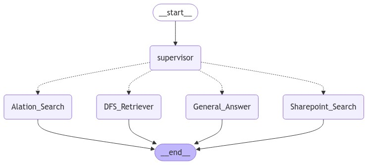

# Volt Service

## Overview

**Volt** is an AI-powered smart assistant built for the Discover Hackathon, designed to provide seamless access to internal assets directly within GitHub Copilot Chat. Volt is registered as a GitHub Copilot agent and leverages Langchain and Langgraph libraries.

The Volt agent consists of both supervisor and worker agents. Various worker agents enable access to internal data from vector databases, call Alation api for database and table structures , and search SharePoint for relevant documents.



## Setup Instructions

To set up Volt, follow these steps:

### 1. Register and Install the GitHub App

- Register the Volt application as a GitHub App in your GitHub account.
- Install the GitHub App to the relevant repositories.

### 2. Configure Callback and Authorization Endpoints

- Set up the necessary callback and authorization endpoints in your GitHub application settings.

### 3. Use ngrok during local development

To expose service to internet, use a ngrok account:

```bash
ngrok http --url=roughy-sure-xxxxxxxxx.ngrok-free.app 8000
```

### 4. Set Environment Variables

You will need to set the following environment variables in .env file:

```
CLIENT_ID=Iv23xxx0IWnt6Hxxxx
CLIENT_SECRET="29c2c1fec30c2xxxxxxxxx68faa95477d"
FQDN=https://roughy-sure-xxxxxxxxx.ngrok-free.app
OPENAI_API_KEY=xxxxxxxxxx
```

## Running the Application

After completing the Git setup, follow these steps to run the application:

### Step 1: Start ngrok Service

Open a terminal and start the ngrok service:

```bash
ngrok http --url=roughy-sure-xxxxxxxxx.ngrok-free.app 8000
```

### Step 2: Run the Application

Execute the `run.sh` script to start the application:

```bash
./run.sh
```
